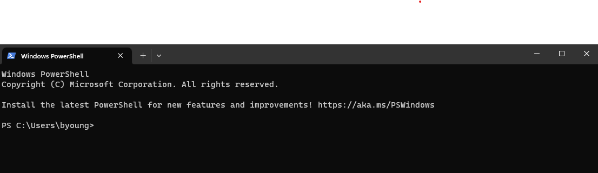
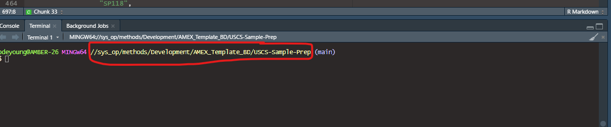
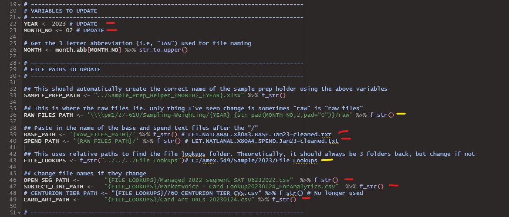

# USCS Sample Prep Documentation

## Setting up the Directory

To set up the directory, you need:
 - A github account
 - Have git installed and configured on your local machine
 - Be added as a collaborator on the repository
   - This is only necessary if you plan on pushing to the repository. You can just make all your changes locally and never push them online and then do not need to be a collaborator.

Here's an overview of git and some basic git commands: [Data Camp git cheat sheet](https://res.cloudinary.com/dyd911kmh/image/upload/v1656573882/Marketing/Blog/git_cheat_sheet.pdf)
### Cloning the Master Branch

1.  Open a command prompt or terminal. It does not need to be PowerShell like is shown below. The commands are the same regardless. It will look something like

    <center></center>


2.  Navigate to the directory where you want to store the cloned repository.
    - If it's February 2023, then you'd run the following in the command prompt. "cd" means change directory, so you just specify the path of the folder you want to hold the USCS Sample prep information.
```
cd \\sys_op\methods\Amex.549\Sample\<YEAR>\<YEAR>-<MONTH_NO>\
```
For example, for February 2023, you would run

```
cd \\sys_op\methods\Amex.549\Sample\2023\2023-02\
```
Now you are "inside" this folder. You can also navigate to the folder in File Explorer, right click once you're inside, and click on "Open in Terminal"

3.  Run the following command to clone the `master` branch:
    - This will create a clone of the template repository in the directory you specified above
```
git clone https://github.com/Beck-DeYoung-NA/USCS-Sample-Prep.git --branch main --single-branch
```
4. That's it. Now a new folder called "USCS_Sample_Prep" has been created with all the files and scripts you need.

P.S., if you are doing this task a lot and do not want to always consult the readMe for the cloning command, you can create an alias.

```
git config --global alias.uscs "clone https://github.com/Beck-DeYoung-NA/USCS-Sample-Prep.git --branch main --single-branch"
```

This will create a new git command for you, so to clone the repository you just need to run

```
git uscs
```

<!-- 
4. Navigate into the new directory

Previously, you had to navigate into the new directory, but now the files populate the parent folder so we don't have to do that. 

### Creating a new branch

We now create a new branch, which just means that you can store the changes made the scripts and files this month without changing anything done in previous months or to the template.  

5. Run the following command to create a new branch for the current month and move into it:

```
git checkout -b USCS_<Month>_<Year>
```

Replace `<Month>` and `<Year>` with the current month and year, respectively. For example, if you were creating a branch for February 2023, you would run:
```
git checkout -b USCS_Feb_2023
```

I've removed all information on updating branches and establishing a connection with github for simplicity. It is not necessary to push the changes to github each month. It only matters that the template file is updated if recurrent changes need to be made. So from this point on, no more git is needed after the folder is downloaded. If you want to see the documentation, open the readMe.md file rather than viewing it on GitHub. The documentation is below in a comment that does not show up when just viewing.

6. Now establish the connection with github. If you have not authenticated github previously, you will have to do so after running this line (a log in will pop up). Remeber to replace \<Month> and \<Year>

```
git branch --set-upstream-to origin/USCS_<Month>_<Year>
```

1.  Now you can make any edits you want to the new files

### Updating the branch
To then save any updates to github, follow the next instructions.

1.  Open a command prompt or terminal.
2.  Navigate to the directory where you cloned the repository. 
    - If you have been making edits in the Rstudio project, you most likely are already in the correct directory in the terminal. So you can open the terminal straight from Rstudio. Just verify you are in the correct folder before you run any commands. You'll get an error if not because "git" commands won't work in a non-repository folder, so if that happens, just renavigate to the desired folder. 

    <center></center>

3.  Run the following commands to stage and commit your changes:

```
git add . 
git commit -m "Describe your changes here"
```

The "." means add all changes. If you want to add changes to certain files then you list them after git add like

```
git add file1 file2 file3
```
There's a lot of variation is this as well. There's ways to add only certain file types, just add changes and not new files, etc. Look here for more information: [Git add](https://github.com/git-guides/git-add).


4.  Run the following command to push your changes to github online:

```
git push
```

As a note, Rstudio has version control integrated into it with a user interface. I'm not the biggest fan of it and I prefer to use the terminal, but it can be used instead.

## Important Notes

 - Once the repository has been cloned and the branch established, anyone can go to that folder and utilize its git capabilities to make changes to the branch. So do not reclone the repository in the same location if someone else has already done it.
 - In general with git, multiple people can make edits on different machines and sync them. But because we all have access to the same drives, we do not need to worry about merging changes since only one person will be using the files at a time and we all have immediate access to those changes. There are no need for commands such as "git fetch" or "git pull". -->

# Folder Strcture

-   **Consumer BD**
    -   `Sample_Prep_Helper_MONTH_YEAR.xlsx` - Contains important infomration on requested frenquecies of the Cell Codes and Marketer Codes, weighting categories, valid DMA codes, and expected ranges of tenure and account spend for augment cells. This information is used for checking if the data lines up with what is requested.
    -   **Scripts** : Scripts for preparing samples
        -   `Config_and_Helpers.R` - Contains helper functions and file paths for the main scripts
        -   `Scripts.Rproj` : The Rstudio project that should be used to run the scripts
        -   `USCS_Sample_Prep_for_Qualtrics1.html` - Output of the `USCS_Sample_Prep_for_Qualtrics1.Rmd` script including information such as warnings on whether or not tests were passed and descriptive tables. This replaces the SAS log and lst files.
        -   `USCS_Sample_Prep_for_Qualtrics1.Rmd` Takes raw text data, cleans it up, verifies frequencies are correct, creates new variables. Prepares sample for weighting. (Replaces steps 1 and 2)
        -   `USCS_Sample_Prep_for_Qualtrics2.html` - Output of the `USCS_Sample_Prep_for_Qualtrics2.Rmd` script including information such as warnings on whether or not tests were passed and descriptive tables. This replaces the SAS log and lst files.
        -   `USCS_Sample_Prep_for_Qualtrics2.Rmd` - Segments the data based on desired weights and creates new variables. Also contains validation checks. (Replaces step 3)
    -   **Data** : Where all intermediary storage files are outputted. These are for convenience of faster loading and are not sent to anyone.
        -   *USCS_Sample_Preremovals.Rdata* - Version of **USCS_Sample** dataframe before removals are made for bad tenure, spend, or date of birth. This is stored to make it easier to revert to the original dataframe if the PM does not want certain people removed
        -   *unweighted_samples_MONTH_YEAR.Rdata* - Contains augmented and main samples created by `USCS_Sample_Prep_for_Qualtrics1.Rmd` for faster loading into `USCS_Sample_Prep_for_Qualtrics2.Rmd`.
    -   **Helper_Files** : Where to store the files used to create the Sample_Prep_Helper excel
        - *Weighting File* : Contains weights for the given quarter
        - *MainFileBuildAugments_NA* : Contains augment specs and SP Code specs  
    -   **Files_to_send** : Contains datasets that should be sent to project managers.
        -   *AmexGABMUSCSSurvey_YYYYMM_DATE.csv* - Final weighted dataset
        -   *USCS_Diagnostics_MONTH_YEAR.xlsx* - Contains important diagnostic sheets
            -   *Cell_Code_Freqs* - Frequency table of Cell codes to be sent to the operations manager
            -   *Main_Code_Freqs* - Main sample marketer code frequencies table to be sent to the operations manager
            -   *Removed_Tenure_or_Spend* - Contains observations deleted because of bad spend or tenure
            -   *Removed_YOB* - Contains observations deleted before of bad ages (<18 or >120)

# Preparatory Steps to do each Month

## Creating `Sample_Prep_Helper_MONTH_YEAR.xlsx`

After pulling from Github, there is a file called `Sample_Prep_Helper_Template.xlsx` in your repository. Rename this to `Sample_Prep_Helper_MONTH_YEAR.xlsx`. 

The `Sample_Prep_Helper_MONTH_YEAR.xlsx` contains 4 sheets :

-   *Augment_Specs* : Contains expected ranges for tenure and account spend for the augment cells
    -   Used to identify observations to remove from the augment
-   *Sp_Code_Freqs*: Contains expected frequencies for each marketer code
-   *Valid_DMA_Codes*: Contains valid DMA codes from Nielsen
-   *Weighting_Segments*: Contains criteria for each weighting segment in terms of what their tenure, account spend, marketer code, and naw cell code are.

1.  *Augment_Specs*

This sheet rarely changes. The information comes from the *Segmentation Criteria* sheet of the `MONTH_YEAR_MainFileBuildAugments_NA.xlsx` file which can be found in the `requests` folder of the job drive for the current month. Make sure the tenure is reported in this sheet in months and not days. **NOTE THAT THE SEGMENTATION CRITERIA SHEET IS INCORRECT FOR CELL14, AND IT SHOULD BE "Any Spend" BECAUSE IT IS A PAYING CARD.**

<center>

| NAW_CELL_CODE | tenure_var_min | tenure_var_max | min_spend |
|:-------------:|:--------------:|:--------------:|:---------:|
|    CELL14     |       5        |                | Any Spend |
|    CELL18     |       2        |       15       | Any Spend |
|    CELL21     |       3        |       15       |   \>$0    |
|    CELL22     |       2        |       15       | Any Spend |
|    CELL35     |       2        |       4        | Any Spend |

</center>

1.  *Sp_Code_Freqs*

The information for this sheet is found in the *Global Criteria* sheet of the latest version of the excel file `MONTH_YEAR_MainFileBuildAugments_NA.xlsx` which can be found in the `requests` folder of the job drive for the current month. Then do the following:

-   Copy and paste the table beginning with the headers **SP Code**, **Card Name**, **Total Sample needed** and down to the row right above the summed total.
-   This is technically all that needs to be done as the script will remove the unnecesarry lines such as one that says "CCSG Prop Lend" in the Card Name as and has no information about Sp Code or Total Sample needed. But you can delete these lines in the excel sheet for clarity if desired. Here's an example of a few lines.

<center>

| SP Code |              Card Name              | Total Sample needed |
|:-------:|:-----------------------------------:|:-------------------:|
|   101   |           CCSG: Platinum            |        39922        |
|   149   |         CCSG: Classic Gold          |        8703         |
|   148   | CCSG: Traditional Gold With Rewards |        3728         |
|   103   |  CCSG: Traditional Gold No Rewards  |        4101         |

</center>

1. *Valid_DMA_Codes*

This sheet can be kept the same unless Nielsen has updated the DMA codes.

4.  *Weighting_Segments*

The weighting segments sheet corresponds to the sheet *YEAR-USCS Targets QUARTER* in the latest `Weighting Target Summary for OPEN and USCS` excel file. You can typically find this in the OPEN where you initially cloned USCS_Sample_Prep.

-   Copy columns E-K into the *Weighting_Segments* sheet. These correspond to columns named **SP_Code**, **Tenure**, **Spend** **X**, and **Weighting_Segment**. 
    -   Column **X** is not importance, hence the lack of name.
    -   If the columns E-K aren't aligned with this configuration, use your judgement to identify which column is which
-   The scripts that perform the weighting DO NOT INFER ANYTHING. All required information must be present in the *Weighting_Segments* sheet prior to running the scripts. This means that extra information not contained in the `Weighting Target Summary` file must be included manually. I've only stumbled across two instances that require manual addition so far.
    -   Some Weighting Segments (i.e.,'ZX132ET' or 'ZX132HTHS') are only for a certain NAW_CELL_CODE (i.e, "CELL66"). This information is not included in the `Weighting Target Summary` file and thus would not be included in the *Weighting_Segments* sheet. This should manually be inputted into the column called **NAW_CELL_CODE**.
    -   Also all SP Codes for a given segment need to be specified in the **SP_Code** column. If it is not specified, specify them manually.
        -   For example. The Weighting Segment "Z01" is labelled under **SP_Code** as "Z01: CENTURION" and does not say it is only for SP 135. Thus, it should be changed to something like "Z01: SP 135; CENTURION". Multiple SP Codes can be specified for the same segment too. The script will extract all 3 digit numbers and treat them as SP Codes

Additional checks for this sheet:

-   If there is no minimum or maximum tenure or account spend, the cell should be left blank or should contain "n/a".
    -   For example, a new segment was created for marketer code 158 for all values. The `Weighting Target Summary` file listed the tenure range as "Any Tenure" and spend range as "Any Spend". These were then manually changed to n/a in the *Weighting_Segments* sheet. They could also be deleted and left as blank cells.
-   I also tend to delete blank rows or rows calculating totals. The script can automatically remove these, but it's cleaner to have them removed in the excel file itself.

Here are a few examples of the different cases; most of which are straight copy paste from the `Weighting Target Summary` file.

<center>

|                         SP_Code                          | Tenure  |   Spend   |   X    | Weighting_Segment | NAW_CELL_CODE |
|:-----------------------:|:--------:|:--------:|:--------:|:--------:|:--------:|
|                   Early Tenure: SP 101                   | \<5 mos |    n/a    | 98242  |       ET11        |               |
| Early Tenure (Other Prop Lend) = 111, 112, 114, 115, 118 | \<5 mos |    n/a    |   20   |       ET35        |               |
|        SP101HTHS: SP 101; High tenure; High spend        | 73 mos+ | \$35,000+ | 649235 |     SP101HTHS     |               |
|                  Z01: SP 135; CENTURION                  |   n/a   |    n/a    | 19424  |        Z01        |               |
|                   Early Tenure: SP 132                   | \<5 mos |    n/a    | 97931  |      ZX132ET      |    CELL66     |
|        SP132HTHS: SP 132; High tenure; High spend        | 73 mos+ | \$2,500+  | 846443 |     ZX132HTHS     |    CELL66     |

</center>

## Changes inside of Scripts

The Major changes to be done each month are for the current date, and file paths. These are located in `Config_and_Helpers.R` script. All variables to update are all the top of the script. The path variables are either absolute or relative paths to the files necessary for the script. 

Theoretically only the lines highlighted in red should need to be changed, and not all need to be updated each month. The lines highlighted in yellow should not need to be updated, but if something is different in a given month (e.g., the folder with the base and spend files is called 'raw files' instead of 'raw' or the `File Lookups` folder is not in the same relative location), these lines need to be changed. If you get an error that a file does not load in because a path does not exist, this is your hint that one of the paths is wrong.

<center></center>

Other changes to the scripts are dependent on the needs of the given month. Hopefully once we identify what is commonly changed, we can dynamically account for those in configuration rather than changing what is hard coded. But obviously, right now, things need to be changed in the code itself.

### *Possible locations for changes*

Find these by clicking on the tab right above the Console that probably says `\# Preparatory Steps`. Then find the named chunks that are specified below.

<center></center>

<br>

`USCS_Sample_Prep_for_Qualtrics1.Rmd` 

1. **Changing Subject Line Definition for Augment**: Chunk `SUBJECT LINE`

`USCS_Sample_Prep_for_Qualtrics2.Rmd`

3.  **New Variable Creation/Adjustment**: Chunk `NEW VARIABLES`
4.  **Reformatting Variables for Qualtrics**: Chunk `Reformatting`

# Creating the Ouput and Running the Scripts

## Running the Scripts

1.  First run through `USCS_Sample_Prep_for_Qualtrics1.Rmd`.
    -   I would suggest running the script a few chunks at a time when first getting the data instead of running the entire script at once. The markdown files generate the output in real time and do it in line. So if you run a certain chunk (hitting the green play button), it will produce the output below the cell. The variables will also all be stored and generated in the environment tab on the right, which makes for easy debugging and problem identification. Everything is chronological and self-contained, so no back and forth between excel and R.
    -   Importantly, any chunk can be run at any time, but will not work properly if the variables required for the chunk have not been created yet. So if you want to run Chunk 10, make sure to run Chunks 1-9 first. But once you have run Chunks 1-10, you can rerun any of them and regenerate the output. Just be aware of overwriting dataframes.
    -   Once you've made it through the entire script without worrying warnings (i.e., all problems have been identified and remedied or noted), then you will knit it to an html document. Click on the arrow next to Knit and select "Knit to HTML". This will run the entire script in the background and generate the output as an HTML. If there were any errors or warnings in the code that prevent it from fully running, then the output will not be generated. So those need to be dealt with first.

<center></center>

2.  Then run through `USCS_Sample_Prep_for_Qualtrics2.Rmd` the same way.

## Output

- The script is outputted an HTML file that contains all the generated tables, warnings if checks are not passed, and success messages if the checks are passed. 
 - The warnings indicate a check is not met. 
   - These will be printouts with "Warning:" before them. 
   - If a check is passed, a message will be printed with "SUCCESS:" before it. 
   - If any warnings are printed, figure out why and report if the warning says to.
